# How I Tackled the Cloud Resume Challenge Step by Step

# Introduction
The Cloud Resume Challenge is a comprehensive project designed to help individuals develop hands-on experience with cloud technologies by building and deploying a resume website using AWS services. This challenge integrates various key concepts, including Infrastructure-as-Code (IaC), CI/CD pipelines, security best practices, and cloud monitoring.

## Benefits of the Challenge
By completing this challenge, I gained:
- Practical Experience with AWS: Setting up and managing cloud infrastructure with S3, Route 53, CloudFront, API Gateway, Lambda, and DynamoDB.
- Infrastructure as Code (IaC) Proficiency: Using Terraform to automate cloud resource provisioning.
- Security Best Practices: Implementing IAM roles, encryption, access controls, and DNSSEC to secure the cloud environment.
- CI/CD Automation: Learning GitHub Actions and OpenID Connect (OIDC) for secure and automated deployments.
- Monitoring and Optimization: Using Amazon CloudWatch to track performance metrics and set up alerts for potential issues.

This challenge not only helped me build a working cloud-hosted resume but also strengthened my knowledge of modern cloud computing principles, making me more proficient in deploying secure, scalable, and automated cloud solutions.

# Setting Up the Frontend

## Downloading and Customizing an Angular CV Template
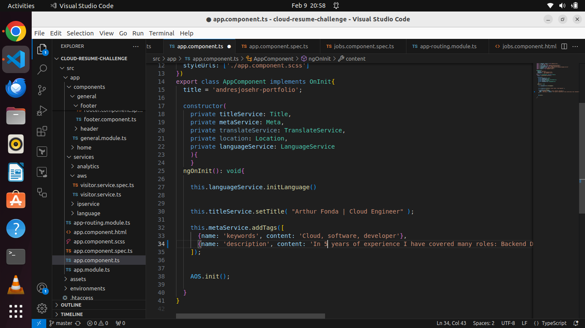
1. Find a free Angular CV template from GitHub or a template provider. In my case I used a template from the following repo : https://github.com/bchiang7/v4
2. Download the template and open it in a code editor (e.g., VS Code).
3. Modify the HTML, CSS, and TypeScript files to personalize the resume.
4. Save changes and test locally by running: 
ng serve

## Enabling Static Website Hosting
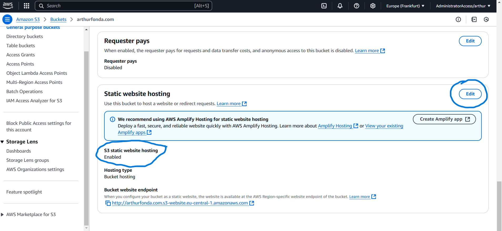 
1. Log in to your AWS account and open the S3 console.
2. Create a new S3 bucket with a unique name. In my case the name is arthurfonda.com
3. Enable public access by modifying the bucket settings.
4. You can configure the static website on s3 using the following aws documentation -> https://docs.aws.amazon.com/AmazonS3/latest/userguide/HostingWebsiteOnS3Setup.html 

## Hosting the Angular CV on S3
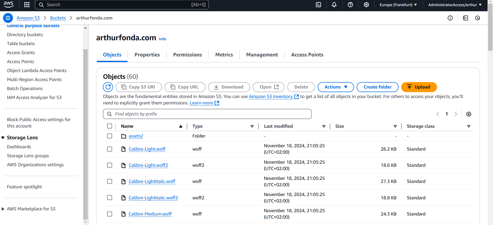
1. Run the production build command in your angular template: ng build --configuration production
2. Upload the dist/project-name/ folder contents to the S3 bucket.

## Configuring S3 Permissions and Public Access
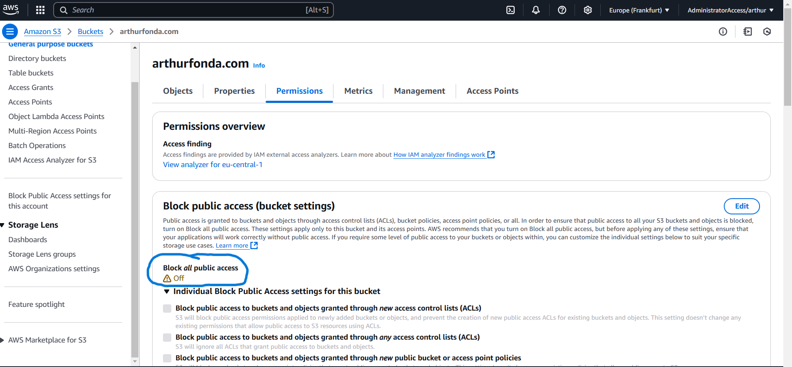
1. Navigate to Permissions in the S3 console.
2. Disable Block Public Access settings.
3. Add a bucket policy to grant public read access.

## Securing S3 with IAM Policies and Bucket Encryption
1. Restrict access to the S3 bucket using IAM policies.
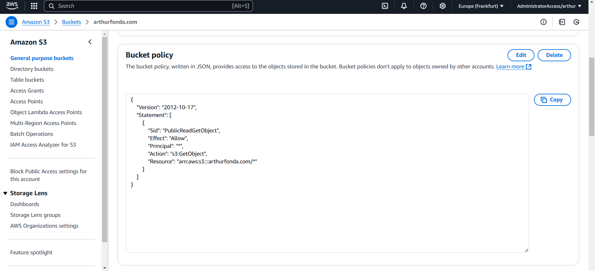

## Testing the Website
1. Retrieve the S3 website endpoint from the Properties tab.
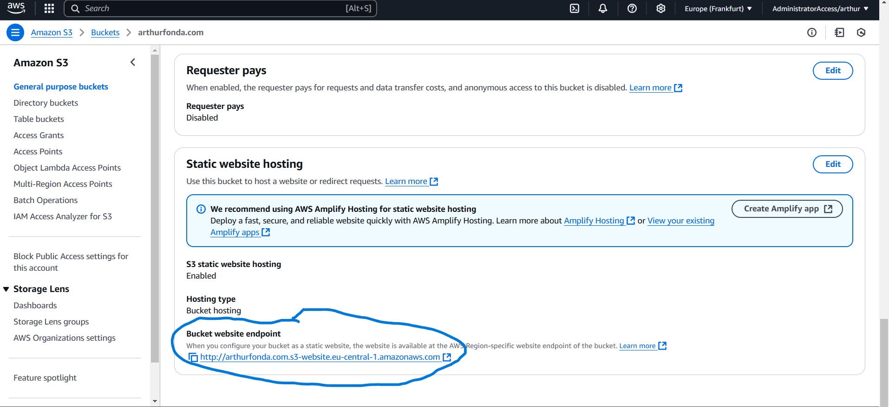
2. Open the URL in a browser to verify successful deployment.
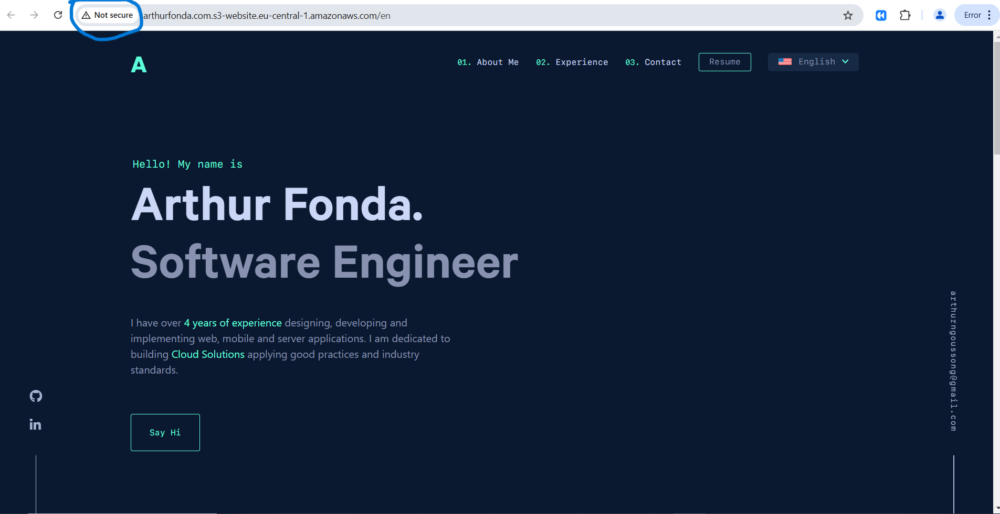

# Configuring DNS and SSL

## Setting Up AWS Route 53 for Domain Routing
1. Open the Route 53 console and create a new hosted zone for your domain.
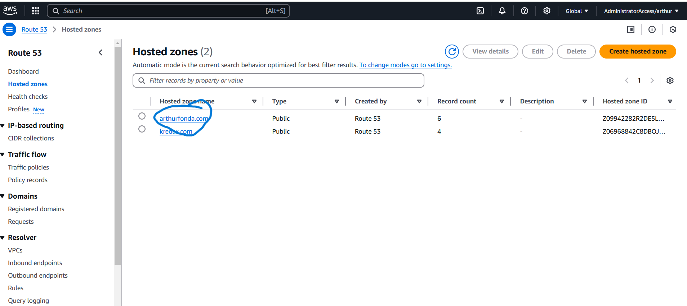
2. Note the NS records provided by AWS.
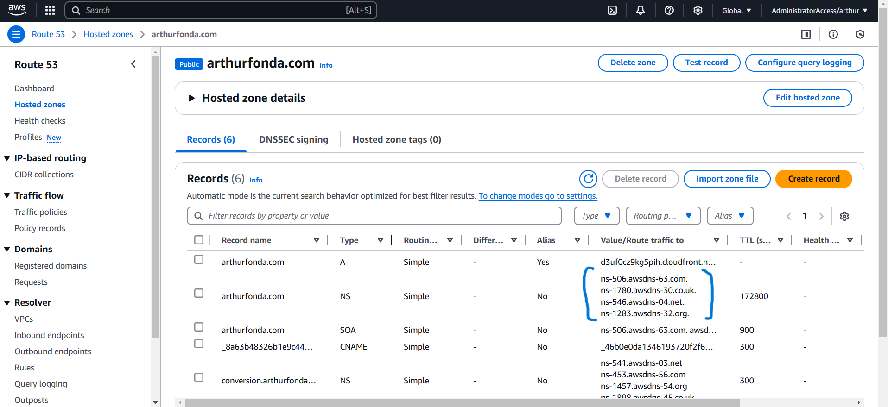

## Changing Domain Name Server (NS) Records
1. If like me you used an external hosting service, log in to your domain registrar.
2. Update the NS records to match those in Route 53. Copy the NS records from AWS and paste into your external domain registrar.
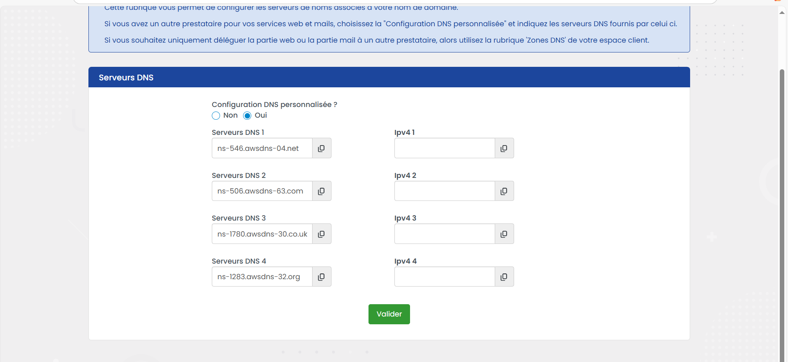

## Creating an SSL Certificate with AWS Certificate Manager
1. Open the ACM console and request a public certificate.
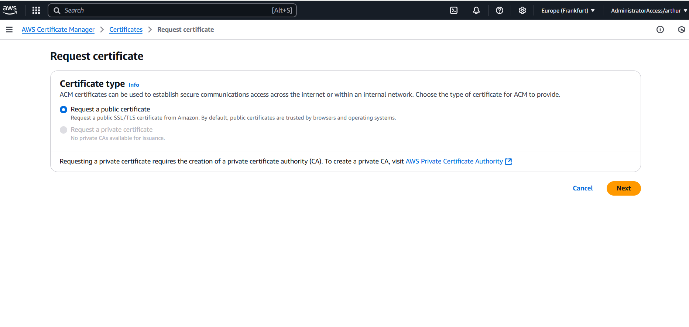
2. Validate ownership using Route 53 DNS verification.
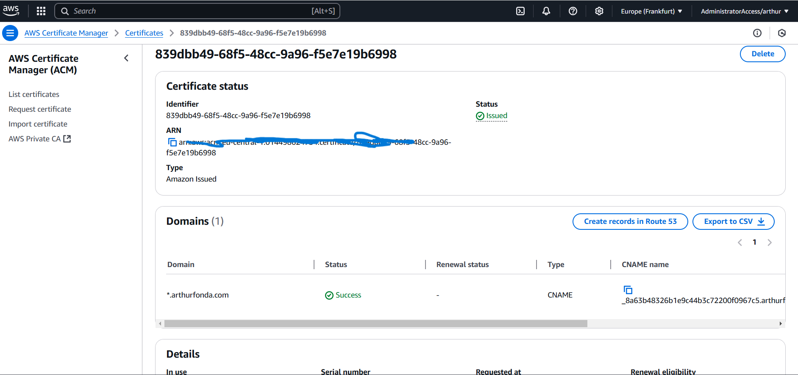

# Setup CloudFront

## Configuring CloudFront for Content Delivery
1. Create a new CloudFront distribution.
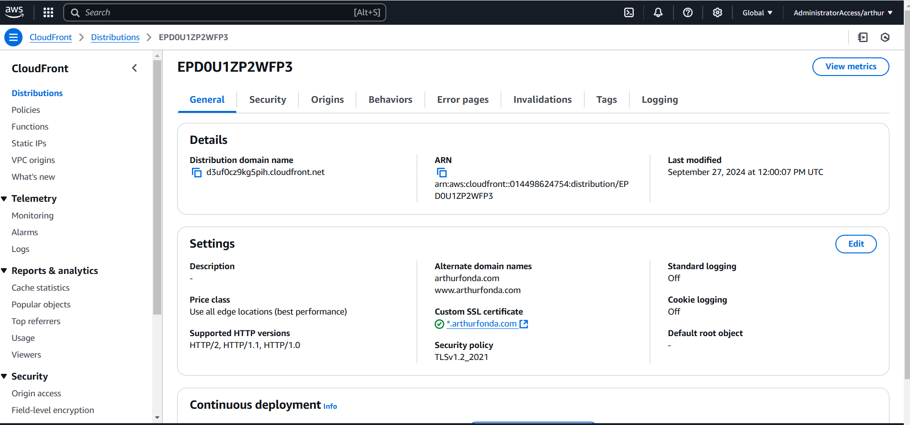
2. Set the origin to the S3 website endpoint.
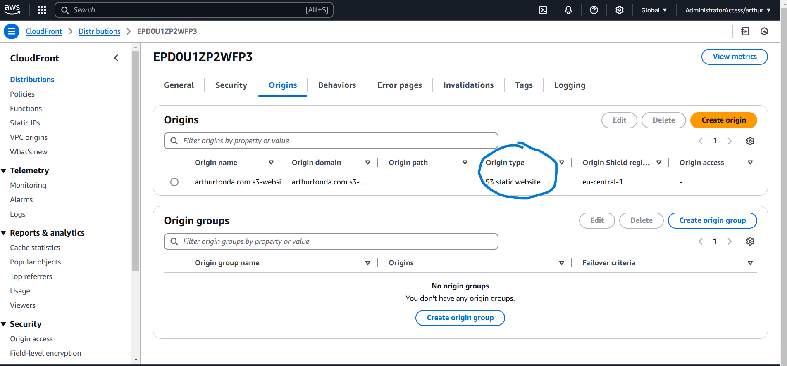
3. Attach the SSL certificate from ACM.
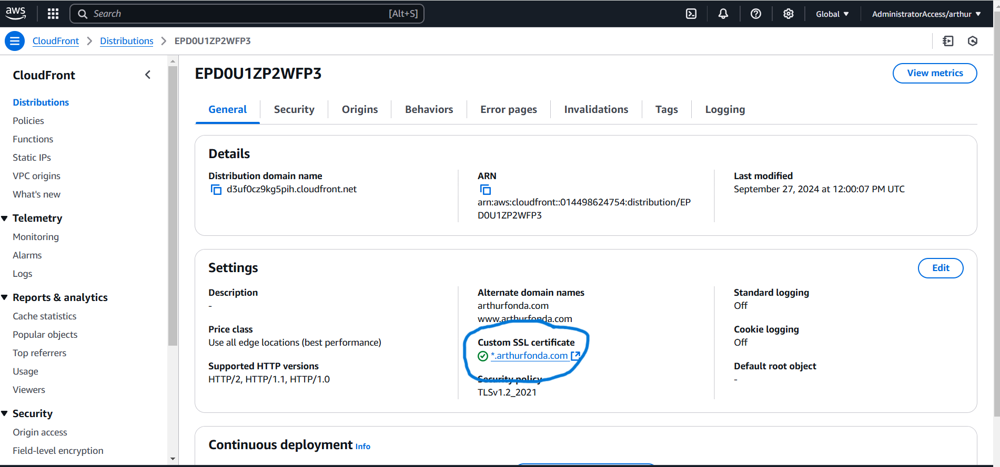

# Developing the Backend

## Setting Up DynamoDB for Data Storage
1. Open the DynamoDB console and create a new table.
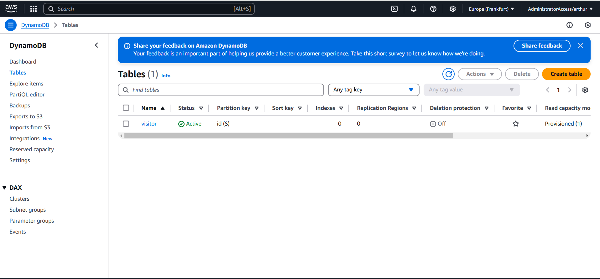
2. Define a primary key and configure auto-scaling.
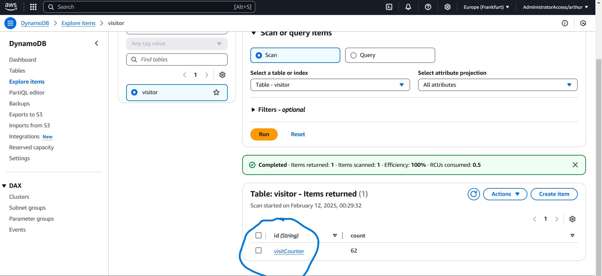

## Creating AWS Lambda Functions
1. Open the AWS Lambda console and create a new function.
2. Choose Node.js or Python runtime and attach necessary permissions.
3. Create a function that count visitors and save the incremented value in DynamoDB
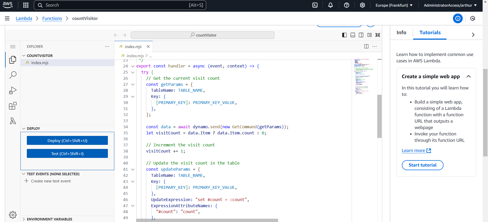

<!-- ## Implementing AWS Lambda Security Best Practices
1. Assign least privilege IAM roles to Lambda functions.
2. Enable AWS X-Ray for function tracing and monitoring.
3. Encrypt environment variables containing sensitive data. -->

## Building a REST API with API Gateway
1. Open the API Gateway console and create a new REST API.
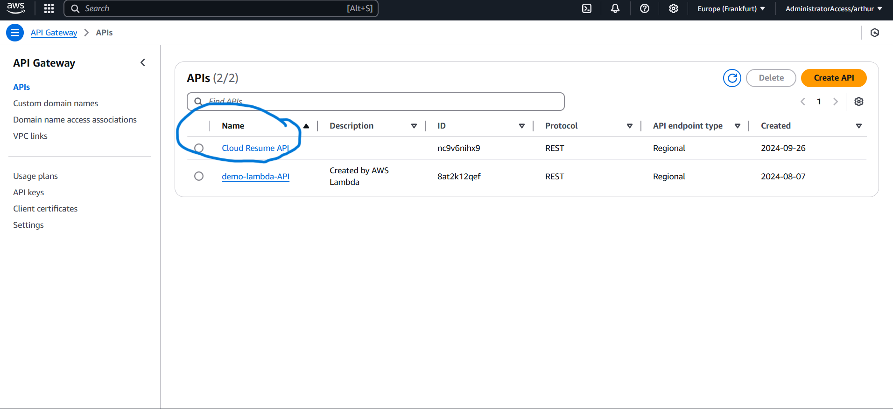
2. Create a post endpoint that will be used in front end each time page is loaded.
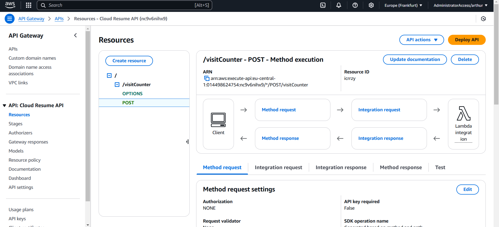 
3. Connect it to the Lambda function.
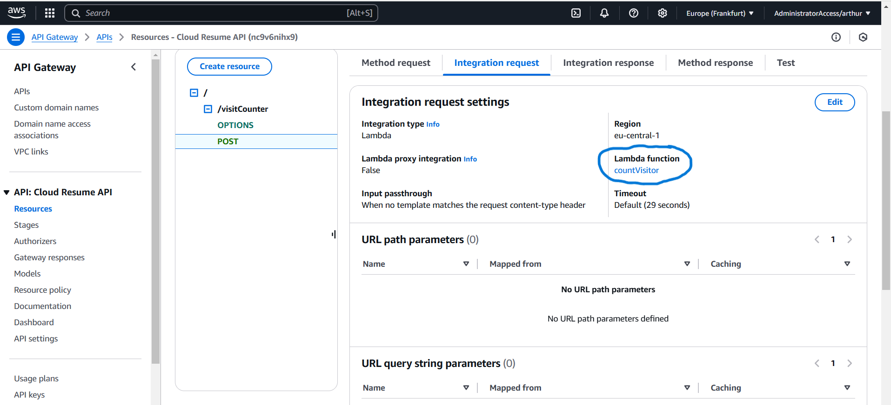

## Enabling API Gateway Security Features
1. Enable IAM authentication for secure API access.
2. Implement rate limiting to prevent abuse.
3. Enable WAF (Web Application Firewall) to protect against attacks.

## Testing API Endpoints
1. Use Postman to send requests and validate responses
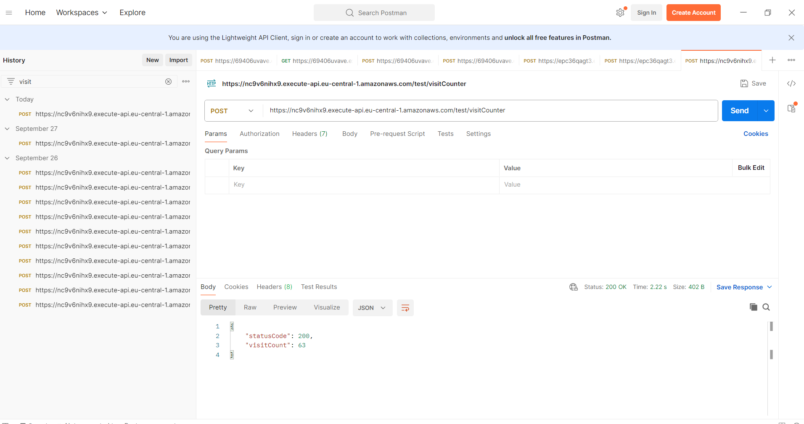

# Monitoring and Optimization

## Using CloudWatch for API Performance Monitoring
1. Open the CloudWatch console in AWS.
2. Navigate to the API Gateway metrics section.
3. Monitor metrics such as IntegrationLatency, Latency, and 5XXError rate.
4. Create custom dashboards to visualize API performance over time.

## Setting Up CloudWatch Alarms
1. Navigate to the Alarms section in CloudWatch.
2. Set alarms for high latency, error rates, and API throttling.
3. Configure notifications via Amazon SNS for real-time alerts.

## Securing CloudWatch Logs with Access Controls
1. Enable encryption on CloudWatch Logs using AWS KMS.
2. Implement strict IAM policies to limit log access to authorized users.
3. Set up log retention policies to automatically archive or delete old logs.

<!-- # AWS Identity Center and Access Management

## Creating Users in AWS Identity Center
1. Open AWS Identity Center and create a new user.
2. Assign the user appropriate permissions based on their role.
3. Enable MFA for additional security.

## Assigning Users to Accounts with Necessary Permissions
1. Create permission sets for different roles.
2. Assign users to AWS accounts using AWS Identity Center.
3. Enforce least privilege access control.

## Implementing IAM Role Security Best Practices
1. Use IAM roles instead of IAM users whenever possible.
2. Restrict access to sensitive AWS resources with tight role policies.
3. Regularly audit IAM roles using AWS IAM Access Analyzer. -->

# Automating Deployment with GitHub Actions

## Configuring OpenID Connect (OIDC) for Secure Deployment
1. Set up an OIDC provider in AWS IAM.
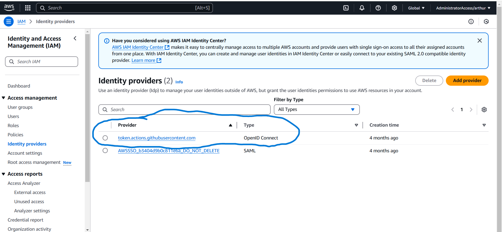
2. Link GitHub Actions with AWS via OIDC.
3. Configure AWS permissions to allow GitHub workflows to deploy securely.

## Setting Up IAM Roles for GitHub Actions with Least Privilege
1. Create an IAM role specifically for GitHub Actions.\
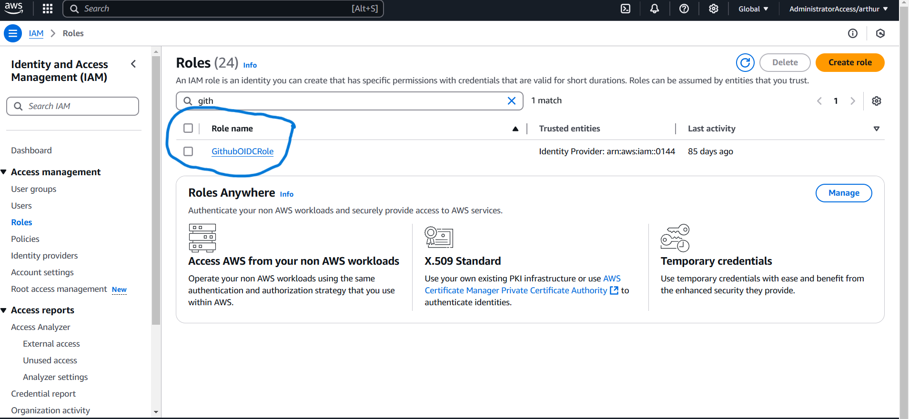
2. Attach only necessary policies for deployment (e.g., S3 upload, CloudFront invalidation).
3. Ensure that no long-term credentials are stored in GitHub Secrets.

## Writing the GitHub Action Workflow
1. Create a .github/workflows/workflow.yml file.
2. Define the necessary build and deployment steps.
3. Ensure the workflow uses OIDC authentication for secure AWS access.
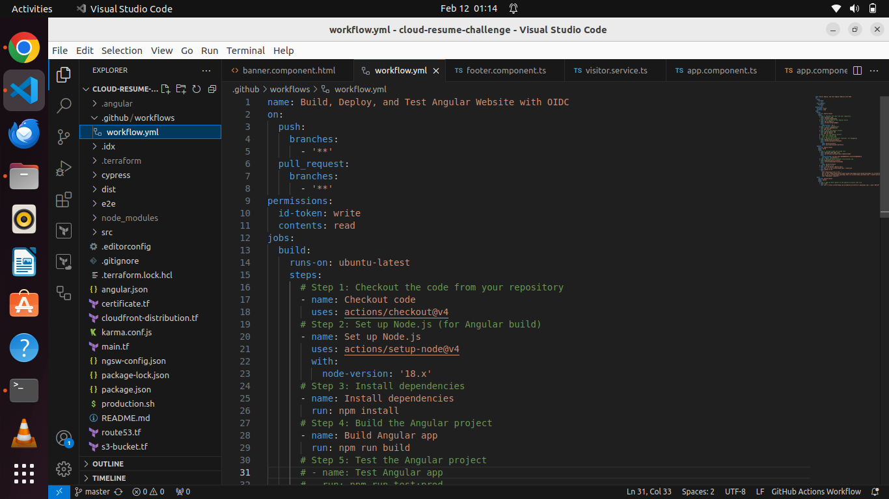

## Securing GitHub Actions Secrets
1. Store secrets in GitHub’s encrypted Secrets Manager.
2. Use environment variables securely within workflows.
3. Rotate secrets periodically to enhance security.

## Handling Deployment Errors
1. Implement retry logic in the GitHub workflow to handle transient failures.
2. Log errors to CloudWatch or GitHub Actions logs for debugging.
3. Use rollback strategies in case of deployment failures.
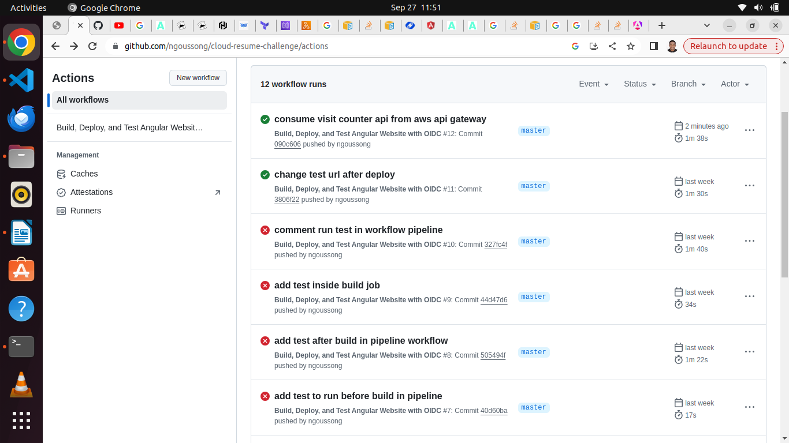

<!-- # Infrastructure as Code (IaC) with Terraform

## Converting AWS Resources to Terraform
1. Use terraform import to bring existing resources under Terraform management.
2. Define infrastructure in .tf files with modular configurations.

## Implementing Security Best Practices in Terraform
1. Use AWS IAM policies to restrict Terraform execution.
2. Store Terraform state securely in AWS S3 with versioning enabled.

## Creating a Development Environment for Testing IaC
1. Create a separate AWS account or use a dedicated sandbox environment.
2. Use Terraform workspaces for managing multiple environments.

## Automating Resource Provisioning with Terraform
1. Run terraform plan to preview changes.
2. Execute terraform apply to deploy infrastructure automatically.
3. Set up CI/CD pipelines to trigger Terraform runs on Git commits.

## Securing Terraform State Files
1. Store state files in an encrypted S3 bucket.
2. Enable state locking using AWS DynamoDB to prevent conflicts. -->

# Conclusion
Completing the Cloud Resume Challenge provided hands-on experience in AWS services, CI/CD automation, and Infrastructure as Code. By leveraging Terraform and GitHub Actions, I streamlined deployments and improved security best practices at every step.